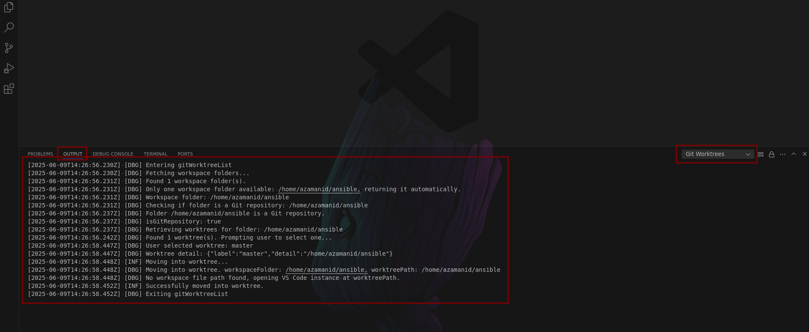

## 💡 How You Can Contribute

Whether it’s your first time contributing or you're a seasoned open-source developer, you're welcome here! Here are some great ways to get involved:

-   📚 **Improve the Documentation** – Typos, clarity, or better examples? We’d love your help!
-   ✅ **Write Tests** – Help us make sure everything works smoothly.
-   📢 **Share the Project** – Tell your friends or tweet about it!
-   ⭐️ **Star the Repository** – A small gesture that means a lot.
-   📋 **Check Out the [TODO List](https://github.com/alexiszamanidis/vscode-git-worktrees/blob/master/TODO.md)** – Grab a task and dive in!
-   🐛 **Report a Bug** – Found something odd? [Open an issue](https://github.com/alexiszamanidis/vscode-git-worktrees/issues) and let us know.
    To help us investigate faster, you can enable debug logging before reproducing the issue:

    1. **Open Command Palette** (`Ctrl+Shift+P` or `Cmd+Shift+P` on macOS)

    2. Enable logs by running:
       `Git Worktree: Toggle Logger Output`

    3. Reproduce the issue(Add/Remove/List).

    4. Copy the relevant log lines.

    5. Attach them to your GitHub issue to help us troubleshoot.

    

## 🚀 Want to Contribute Code?

Awesome! Here’s a quick guide to get started:

1. **Fork the Project**
   Click the _Fork_ button at the top right of the repository.
2. **Clone Your Fork**

```bash
git clone https://github.com/your-username/vscode-git-worktrees.git
cd vscode-git-worktrees
```

3. **Make Your Changes**
   Work your magic — whether it’s a new feature, a fix, or docs improvement.
4. **Open a Pull Request**
   Go to the original repository and click Compare & pull request. Add a helpful description and submit!

### 🛠️ Run the Extension Locally

Want to test or develop the extension on your machine? Here’s how:

```bash
# Install dependencies
yarn

# Compile the code and watch for changes
yarn watch
```

Then, open the project in Visual Studio Code, press F5, and it will launch in a new Extension Development Host window.

To enable detailed logging:

1. **Open Command Palette** (`Ctrl+Shift+P` or `Cmd+Shift+P` on macOS)

2. Enable logs by running:
   `Git Worktree: Toggle Logger Output`

When running locally this way, logs will appear in the Output Console, helping you trace the extension’s behavior in real time.
